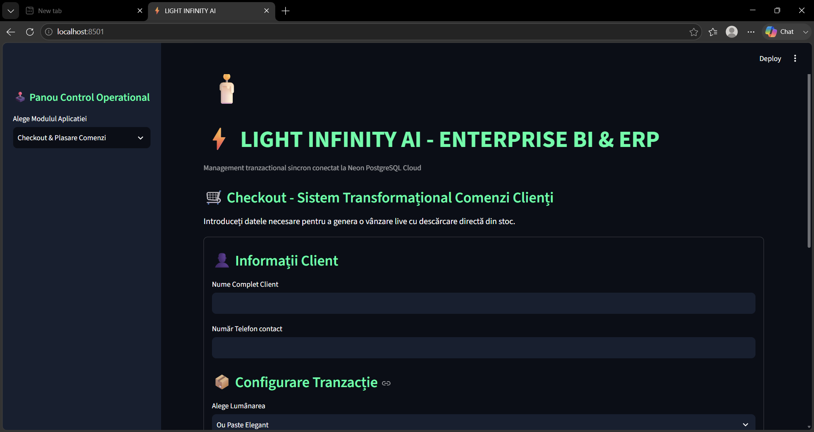
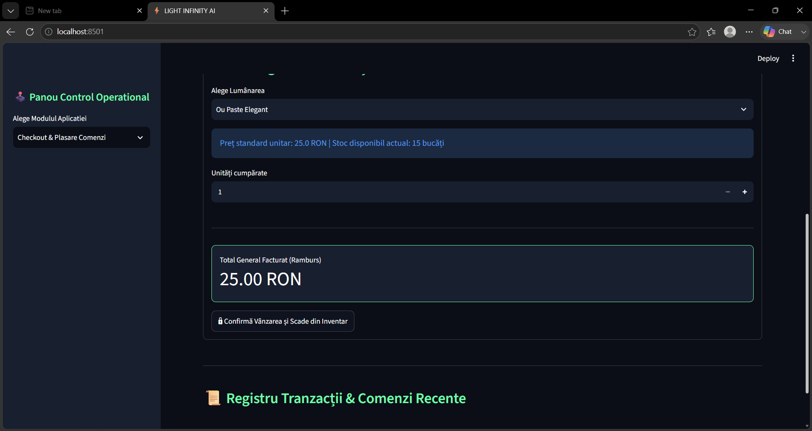
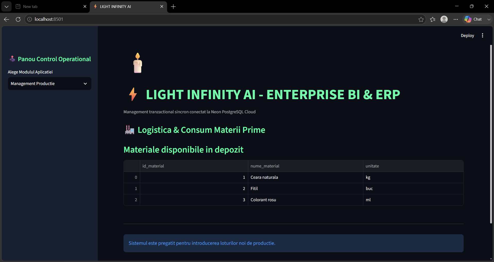
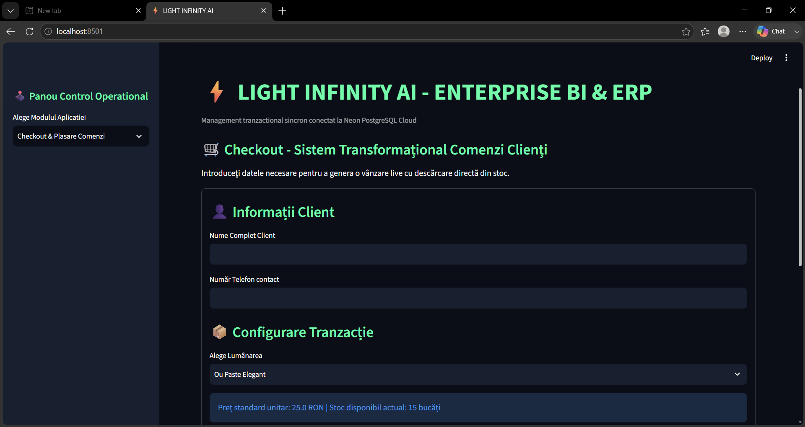
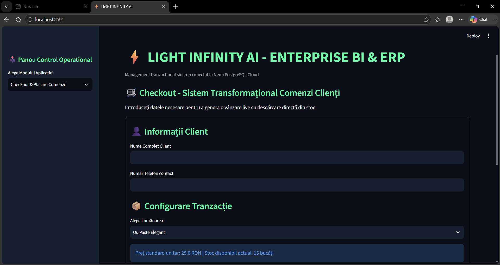
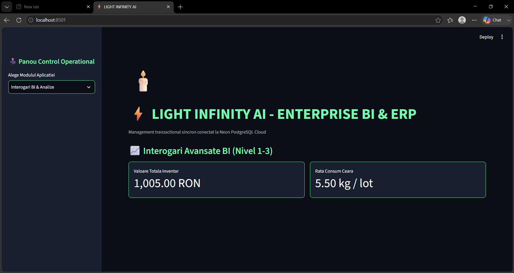

# ⚡ Light Infinity AI — Enterprise ERP & Business Intelligence (BI) Platform

<p align="left">
  <a href="https://github.com/Codedchic25/light_infinity_ai_enterprise_erp" target="_blank">
    <kbd>&nbsp;💼 <b>LinkedIn Profile</b>&nbsp;</kbd>
  </a>
  <kbd>&nbsp;🐍 <b>Python 3.12+</b>&nbsp;</kbd>
  <kbd>&nbsp;☁️ <b>Neon PostgreSQL</b>&nbsp;</kbd>
  <kbd>&nbsp;⚡ <b>Managed by UV</b>&nbsp;</kbd>
  <kbd>&nbsp;🛠️ <b>Linter: Ruff</b>&nbsp;</kbd>
</p>


A high-performance, enterprise-grade resource planning (ERP) and transaction management system designed for industrial manufacturing environments. Built on **Domain-Driven Design (DDD)** principles and **Clean Architecture**, this platform decouples asynchronous public client ordering workflows from secure internal operational controls, synchronized live via a multi-tenant cloud data infrastructure.

---

## 📸 System Walkthrough & UI Deep-Dive

### 🛒 Client-Facing Public Interface (Frontend / B2C)
*Streamlined transactional interface optimized for single-point user interactions and low-latency order injection.*




---

### 🏭 Operational Enterprise Resource Planning (Internal Backend / ERP)
*Secure operations dashboard tailored for production scheduling, real-time raw material inventory monitoring, and fulfillment tracking.*





---

### 📈 Predictive Business Intelligence Framework (Analytical BI)
*Analytical view rendering advanced data visualizations, aggregation schemas, and velocity metrics to support data-driven decision making.*




---

## 🏗️ Architectural Blueprint (Modular Domain Separation)

To minimize technical debt and maximize testability, the project implements strict bounded contexts:

*   **`app/core/`**: Centralized configuration management, application initializers, and cross-cutting concerns.
*   **`app/db/`**: Connection pooling abstraction layers and session lifecycle management for Cloud PostgreSQL infrastructure.
*   **`app/migrations/`**: Data schema evolution pathways and historical state rollbacks engineered using declarative migration scripts (**Alembic**).
*   **`app/modules/` (Domain-Driven Core)**:
    *   `orders/`: Processes ACID-compliant financial transactions, invoice computation, and inventory allocation hooks.
    *   `production/`: Manages bills of materials (BOM), active manufacturing stages, and process controls.
    *   `products/`: Governs localized catalogs, entity relational mapping, and variations.
    *   `bi/`: Executes complex database queries, analytical transformations, and multi-dimensional metrics generation.
*   **`app/ui/`**: Presentation layer leveraging decoupled View components to completely isolate public user access paths from management scopes.

---

## 🛠️ Technology Stack & ATS Keywords

*   **Programming Paradigm**: Object-Oriented Programming (OOP), Domain-Driven Design (DDD), Clean Architecture.
*   **Backend & Data Layer**: SQLAlchemy ORM, Cloud-Native Neon PostgreSQL, Relational Database Design (RDBMS), Advanced SQL Query Optimization, Database Migrations (Alembic).
*   **Data Visualization & BI**: Multi-dimensional Data Aggregations, Analytical Pipelines, Interactive Charts.
*   **Developer Experience & Tooling**: `Astral UV` Package Orchestrator, Virtual Environment Management, `Ruff` Static Code Analysis & Linting Automation, Git Version Control.

---

## 🚀 Local Deployment & Environment Setup

This project uses the modern `uv` ecosystem for dependency resolution and execution isolation.

### 1. Repository Initializer
```bash
git clone https://github.com/Codedchic25/light_infinity_ai_enterprise_erp
cd light-infinity-ai
```

### 2. Environment Variables Provisioning
Construct an environment configuration file named `.env` at the root directory of the application workspace using the format provided below:
```text
DATABASE_URL=postgresql://<db_user>:<db_password>@<neon_cluster_endpoint>/<db_name>?sslmode=require
```

### 3. Application Launch Execution
The `uv` package manager natively detects `uv.lock`, automatically builds the isolated `.venv` workspace, ensures strict dependency locking, and bootstraps the Streamlit runtime environment:
```bash
uv run streamlit run dashboard.py
```

The web server will spin up a local listener, accessible instantly via your preferred web browser at: `http://localhost:8501`.
